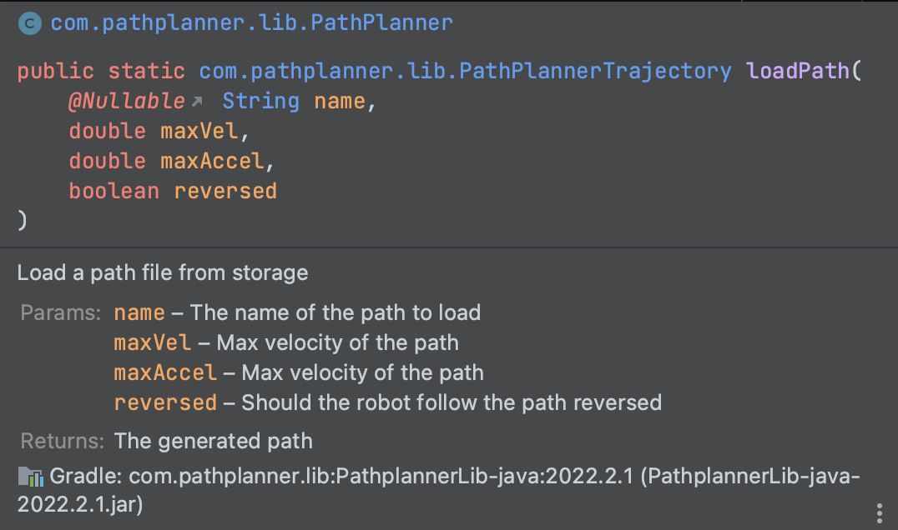
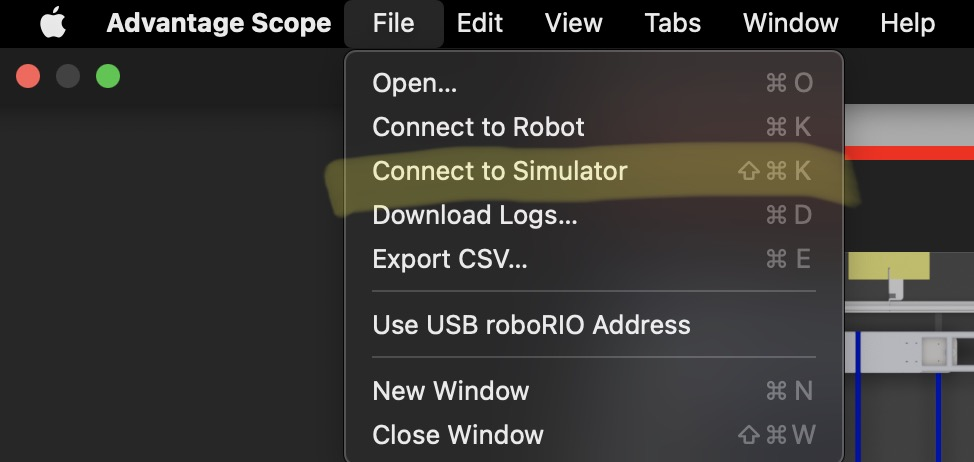
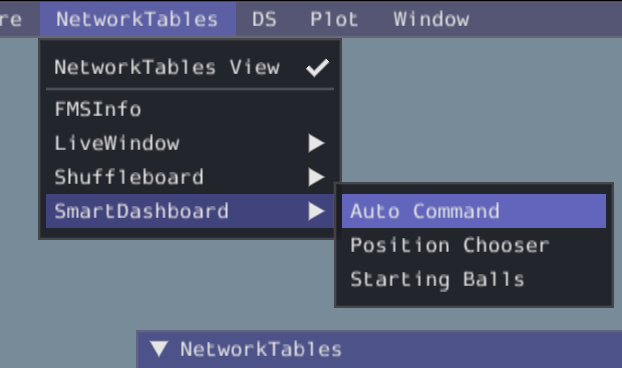

# Programming Training

## Installing Software
Our programming will be done through Java and VSCode, but if you have another IDE you want to use, you can talk to Michael Yu on Basecamp or find him in person. Additionally, we will be using Github and Git for version control. We will also be using some tools from other teams like AdvantageScope and Pathplanner. 
1. Download [WPILib](https://github.com/wpilibsuite/allwpilib/releases/latest/):
   1. Click on the link above and scroll to the bottom of the page
   2. Click on the file that has your operating system on it (Choose Windows32 for Windows users)
      1. Windows:
         1. Open your downloads folder
         2. Right-click the WPILib-Windows32 file
         3. Click on "Mount"
         4. Click on "This PC" in the left column
         5. Look for DVD Drive WPILib-Windows32 and double-click on it
      2. MacOS
         1. Go to downloads
         2. Double-click on installed file
   3. Double-click on WPILibInstaller
   4. Click on "Start"
   5. Select "Everything" and click "Install for this User"
   6. Click on "Download for this computer only"
   7. Click on Finish once it is complete
      1. If you are using a Mac follow the instructions below
         1. Drag VSCode Application from the folder that opened to your dock
         2. Then open it and follow [this guide](https://docs.wpilib.org/en/stable/docs/yearly-overview/known-issues.html#visual-studio-code-extensions-fail-to-install-on-macos) to finish setting up your VSCode
2. Download [AdvantageScope](https://github.com/Mechanical-Advantage/AdvantageScope/releases/latest):
   1. Click on the download for your operating system
      1. Windows
         1. Drag the file to your desktop
      2. MacOS
         1. Double-click on the file in your downloads
   2. Once you have it successfully downloaded, open it
   3. Then open the Preferences Page and set `roboRIO address` to `10.31.81.2`
3. Download PathPlanner:
   1. You can find PathPlanner on the Windows and Mac App Store, but it is also available on Github for direct download.
      1. [Mac App Store](https://apps.apple.com/us/app/frc-pathplanner/id1593046876)
      2. [Windows Store](https://www.microsoft.com/en-us/p/frc-pathplanner/9nqbkb5dw909?cid=storebadge&ocid=badge&rtc=1&activetab=pivot:overviewtab)
      3. [Github](https://github.com/mjansen4857/pathplanner/releases/latest)
4. Download Git:
   1. Follow [this guide](https://github.com/git-guides/install-git)
5. Make Folder:
   1. You will probably want to store all the programming files in a folder
   2. Navigate to your desktop and create a folder called "FRC"
6. Sign up for GitHub:
   > **NOTE:** You can use your school email, but I highly recommend you use a personal one, as your GitHub can be used later on through college and even work. 
   1. Click on [this link](https://github.com/signup) to signup

## Learning the Basics
### Part 1: Gaining a Basic Understanding
Firstly, you have to bookmark [this page](https://docs.wpilib.org/en/stable/index.html).
That page is a how-to guide for basically most things you will be confused about, while their explanations can be confusing, it is still very helpful.

Next, I highly recommend that everyone reads/skims through these pages, as it'll make the code make a lot more sense logically.
1. [Intro](https://docs.wpilib.org/en/stable/docs/software/commandbased/what-is-command-based.html)
2. [Subsystems](https://docs.wpilib.org/en/stable/docs/software/commandbased/subsystems.html)
3. [Commands](https://docs.wpilib.org/en/stable/docs/software/commandbased/commands.html)
4. [Command Scheduler](https://docs.wpilib.org/en/stable/docs/software/commandbased/command-scheduler.html)
5. [Command Base Structure](https://docs.wpilib.org/en/stable/docs/software/commandbased/structuring-command-based-project.html)

### Part 2: Logging Framework
We are using 6328's AdvantageKit for logging. You can read [this page](https://github.com/Mechanical-Advantage/AdvantageKit/blob/main/docs/START-LOGGING.md) for more details or you can just read the summary below.

#### Quick Summary:
AdvantageKit follows the rule of logging all inputs. This means that all interactions with hardware (motors, sensors, etc.) should be logged. This is done through 4 main layers:
1. IO Layer
   1. This layer consists of all communication with motor controllers and sensors, which allows for everything to be replayed later on.
   2. This also has the advantage of allowing for different types of hardware and simulations to be easily swapped in.
2. Control Layer
   1. This layer exists inside the subsystem, using the IO layer to control motors and read sensors. This layer should contain most of the processing of data and decision-making.
   2. This means that updated control logic can be changed and replayed with the same inputs for debugging. 
3. Public Interface
   1. These methods are used in subsystems for the rest of the robot code to interact with the subsystem.
4. User Outputs:
   1. This layer allows for the user to log any extra data they want.

## Actually Programming
### Instructions
With your basic understanding of how the code functions now, your goal is to make some functioning auto paths. This will likely be very confusing, so don't be afraid to look things up.

#### Getting Started
1. Fork this repository by clicking the button in the top right that says `Fork`
2. Clone this repository
   1. MacOS
      1. Press `CMD` + `Space` and type in `Terminal` then press enter
      2. Type `cd Desktop/FRC` 
   2. Windows
      1. Search for `Git Bash` and open it
      2. Type in `cd c:\Users\YOUR_USERNAME\Desktop\FRC`
3. Go back to your fork on GitHub and click on the green `Code` button
4. Click on HTTPS and then copy the text in the box
5. Type `git clone (paste what you copied)`

#### Making Code Work
There are 4 major steps in getting your code to work.
1. Create methods in the Drive subsystem
   1. The method shells have been left in the class, all you have to do is figure out what to put in the methods
2. Create commands, you will need these 2
   1. DriveResetPose - resets the robot pose and encoders
   2. DriveZero - drive at 0 volts
3. Create paths (this is detailed in section below)
4. Setup you auto in RobotContainer

#### Making a Trajectory with PathPlanner
1. First Launch
   1. Open PathPlanner
   2. Click on `Open Robot Project`
   3. Choose directory of `Programming Training` (Should be on your desktop in FRC folder)
2. Future Launches
   1. Click on the `≡` button
   2. Make sure the top left says ProgrammingTraining
   3. If it doesn't click `Switch Project` and choose your project directory
3. Creating Paths
   1. [Basic controls](https://github.com/mjansen4857/pathplanner/wiki/Controls-&-Shortcuts#ui-controls)
   2. These paths will automatically be imported in to your robot code
4. Using Paths
   1. Using Original Class:
      1. 
      2. Example: `Trajectory PATH = PathPlanner.loadPath("5BallAuto", 10.0, 5.0, false);`
   2. Using Wrapper Class:
      1. This class only requires `name` + `reversed` variable, as it gets maxVel and maxAccel from the Constants file
      2. Example: `Trajectory PATH = PathPlannerHelper.loadPath("5BallAuto", false);`

#### Testing your code
1. Press the WPILib button in the top right of VSCode
2. Type and select `Simulate Robot Code`
3. If your code builds, select `Sim GUI` and press Ok
4. You will now need to open AdvantageScope
5. Click on `File` in the top left and select `Connect to Simulator` 
6. You should see a red dot appear in the top right which indicates that you are connected to the simulator live
7. Click on the Odometry tab and drag `/RealOutputs/Drive/Pose` to `Robot` under `Pose Data`
8. Go back to the Simulator GUI and add your Auto Command Chooser to the GUI 
9. Then select your which auto to run from the `Auto Command`
10. Lastly you can select change the RobotState to `Autonomous`
11. You can now go back to AdvantageScope and view your auto run

### Advanced Programming
If you have finished everything above and have a working simulated auto, you can attempt to make a `DriveIOSparkMax` layer so that your auto can be run on the actual robot. All the constants you need are located in the Constants file.